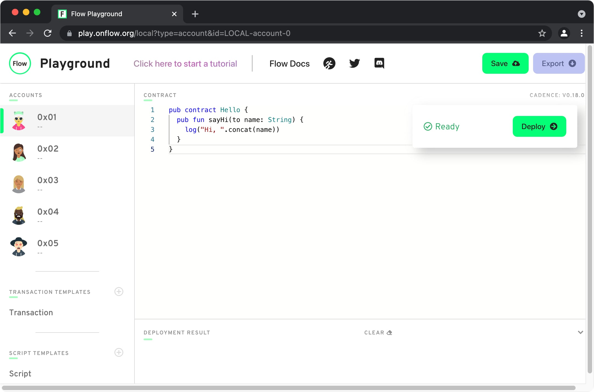
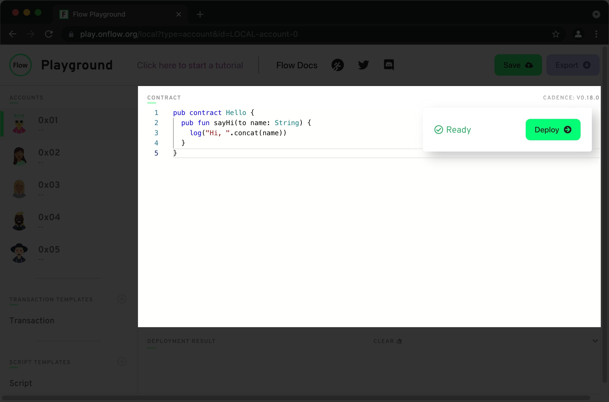
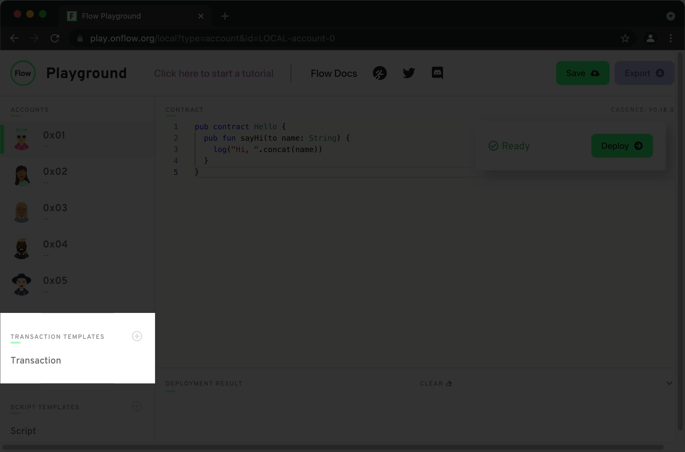
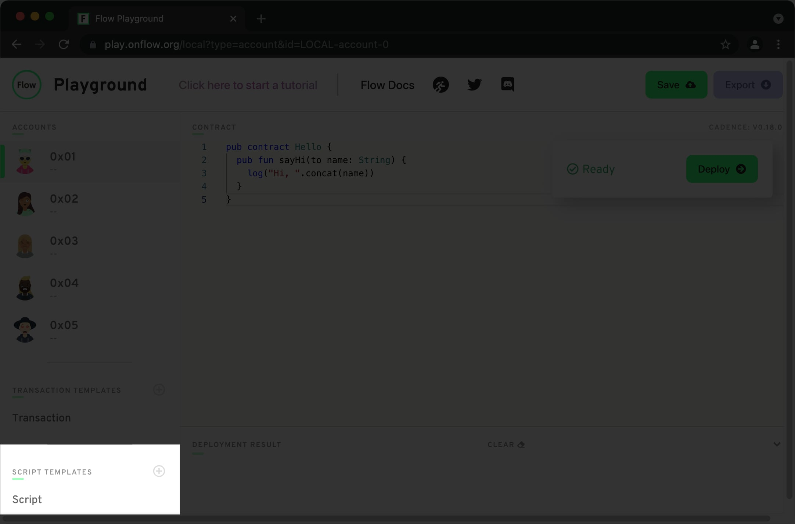
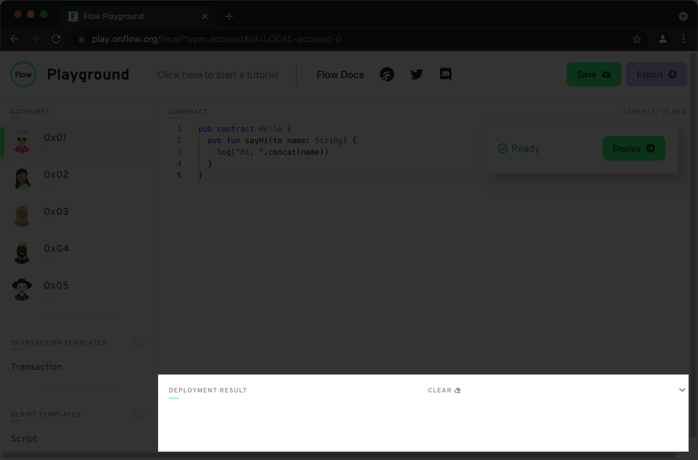
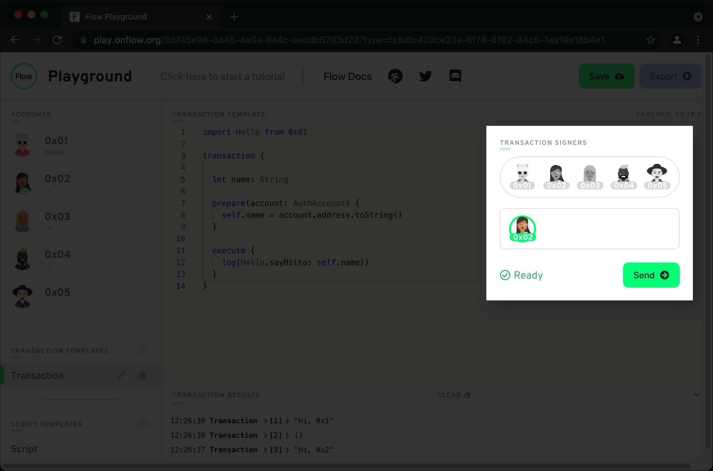
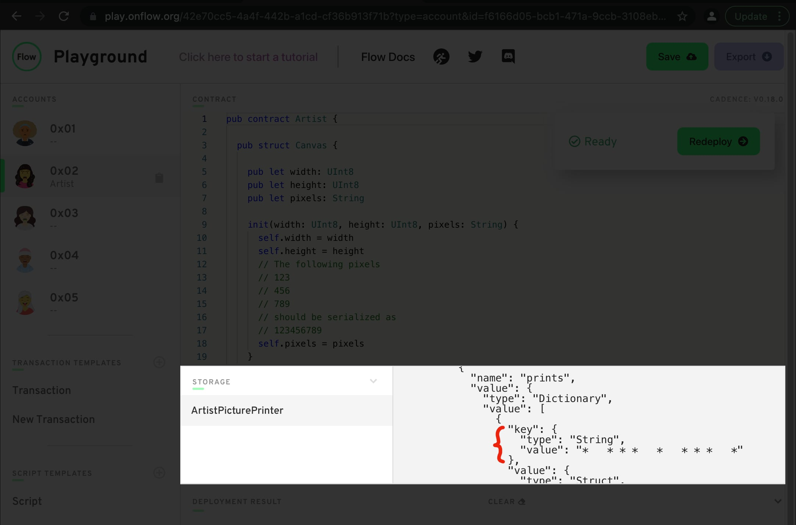

# Fast Floward | Week 1 | Day 2

Welcome back! I hope day 1 was fun and interesting. Today we'll get to learn about another Flow developer tool – **Playground**. Also, we'll write our first *smart contract* and get to interact with it using *transactions* and *scripts*. Should be exciting! But first, let's review what we learned during day 1.

# Day 1 Review

- Flow is a cool blockchain.
- Cadence is the programming language for writing DApps on Flow.
- We can use `flow cadence` as a REPL shell, and `flow cadence file.cdc` to execute scripts.
- Cadence is strictly typed, and we explored the following built-in types.
  - `Int`
  - `Fix64`
  - `Address`
  - `String`
  - `Array`
  - `Dictionary`
- Cadence optionals, for example `let optional: String?`, are used when values can be `nil`.
- Cadence functions are value types with named labels.
- Cadence has two composite types:
  - `struct`: value type (copied),
  - `resource`: linear type (moved, can only exist once).
- Cadence `resource`'s use `<-` notation for movement, special keywords `create` and `destroy`, and `@` to denote resource type, for example `let canvas: @Canvas`.

# Videos

- [Day 2 – Review, Flow Playground, Smart Contracts, Transactions, Scripts + Quests](https://youtu.be/4wpoqDKzw8Y)

# Office Hours

- [Quest implementation and general Q&A](https://www.youtube.com/watch?v=DwLdLnx8jKE)

# Playground

We executed our first lines of Cadence code using `flow cadence`. It's a great way to get started, when all we need is a programming language interpreter. However, decentralized applications are more than just interpreted code, they also interact with a global state which is the blockchain.

Flow provides us with a number of options to get started.

- A public testnet
- A self-contained local Flow emulator
- Playground

Today, we're going to use **Playground**, but we'll tackle the other two later this week.

## Environment

Fire up your browser and open up [play.onflow.org][1] to launch Playground.



There are 5 key sections of the Flow Playground interface, let's take a look at each one.

## Cadence Editor

This is where you'll store your Cadence code. Because Playground emulates the Flow blockchain, there are special limitions that don't exist in the Cadence REPL shell.

- You can only define `contract`, `struct`, and `resource` types when in the **contract** editor, which you open by selecting any **account** from the left pane.
- Same goes for Cadence `event`'s.

Once you're ready to deploy a contract, hit that big green **Deploy** button. The button to re-deploy a contract will take its place.

Flow Playground allows you to update existing contracts, however, it's known that sometimes updates can fail and if you encounter a problem that shouldn't be there, try opening up a new Playground and deploying your contract there.



## Accounts

In Flow, everything is stored with accounts, including smart contracts. So to do anything, you'll need access to one or more accounts, thankfully Flow Playground provides us with 5 auto-generated accounts. This is a huge time saver.

One Playground limitation is that each account can only have one contract deployed.


## Transactions

This is where you define Flow transactions. Transactions are generally used to mutate the state of the blockchain, and as such need to be signed by every party that's involved. As with every blockchain, Flow transactions have to be signed cryptographically using a private key to encode transaction data. Thankfully, Playground abstracts this and signing transactions is a one-click effort.



## Scripts

The **Scripts** pane is where you define Flow scripts, which are read-only programs that don't require any blockchain mutations. As such, they don't incur a gas fee, unlike transactions (even though Playground doesn't have any fees), and they don't require authorization from any account.



## Log and Storage

Cadence provides an awesome quality-of-life feature for developers – `log()`. You can log variables, see how state changes as your program is executed, we already got to experience this with `flow cadence`. Playground is the only other place that let's you see your `log()` outputs.

In the bottom pane you'll also find account storage information, once you start storing data with accounts.



# Contract #1

Let's create our first Cadence smart contract!

1. Select `0x01` from the **Accounts** pane.
2. Type out the following code

```cadence
pub contract Hello {
  pub fun sayHi(to name: String) {
    log("Hi, ".concat(name))
  }
}
```

3. Hit **Deploy**
4. Get confirmation from the logs.

```
11:11:11 Deployment > [1] > Deployed Contract To: 0x01
```

At this point you'll see the name of the contract you deployed displayed under the `0x01` account in the Accounts pane. The name in this case is taken directly from the source code, but outside of Playground you deploy contracts with a `name: String` and the contract source code. So each account can have multiple instances of the same contract under different names. As mentioned previously, Playground accounts only support one contract each.

OK, now that we have a blockchain program deployed, let's interact with it! Flow provides two distinct ways to do this.

- Scripts: anonymous and read-only.
- Transactions: authenticated, can mutate blockchain state, and are cryptographically signed.

We'll do one of each to see them in practice. Click on **Script** and let's write some code.

# Script #1

This should look familiar to you. We used the same entry point `main()` to run our Cadence code in day 1, but now we have access to smart contracts!

We begin by `import`ing contracts we want to interact with from account addresses that are hosting them. You can think of this pattern much like when you import a class from a library in a package manager. Given how on Flow, everything is stored with accounts, naturally they store all the existing contracts.

```cadence
import Hello from 0x01

pub fun main() {
  let name = "FastFloward"
  Hello.sayHi(to: name)
}
```

Click on **Execute** and you'll see two lines in the **Log** pane.

```
11:11:11 Script > [1] > "Hi, FastFloward"
11:11:11 Script > [2] Result > {"type":"Void"}
```

You normally fetch information about public state using scripts, so it's expected that they `return` some kind of value. In our case we're not explicitly returning anything, but similar to JavaScript when functions `return undefined`, in Cadence functions without explicit `return` statements return the `Void` type.

Now, moving on to transactions...

# Transaction #1

For reference, please use the [documentation][2]. Our script was able to interact with a public function of the `Hello` contract, with transactions we can add authorized accounts into the mix. Let's write our first transaction.

```cadence
import Hello from 0x01

transaction {

  let name: String

  prepare(account: AuthAccount) {
    self.name = account.address.toString()
  }

  execute {
    log(Hello.sayHi(to: self.name))
  }
}
```

Same as with **Scripts**, we begin by importing all the contracts we'll be interacting with.

Then we declare the `transaction` body and its contents. Each transaction has 4 phases that are sequential, however they're all optional.

```cadence
transaction(randomParameter: String) {
  let localVariable: Int
  prepare(signer: AuthAccount) {}
  pre {}
  execute {}
  post {}
}
```

If we want to share data between the 4 phases, we can declare local variables inside the `transaction` body, no access modifiers needed.

## Prepare phase

The only phase where you have direct access to account storage and other private functionality provided by an instance of `AuthAccount`. For now, we're just doing to use the `address` field, but you can learn more in the [docs][3].

## Execute phase

In this phase, you should store the main logic for your transaction. You **may not** access private `AuthAccount` objects here.

For now, we'll only need the `prepare` and `execute` phases.

In our `prepare` phase, we grab the `account.address` and store for later access in the `execute` phase.

In the `execute` phase, we call the `sayHi` function of the `Hello` contract, using the signing account address for the `name` argument.

## Executing a Transaction

Let's go a head and execute this transaction! In the **Transaction Signers** pane, pick one account, any account, and click **Send**.



You should see the **Log** pane updating with the different account addresses.

```
11:11:11 Transaction > [1] > "Hi, 0x1"
11:11:11 Transaction > [2] > ()
11:11:12 Transaction > [3] > "Hi, 0x2"
11:11:12 Transaction > [4] > ()
```

# Contract #2

Now that we're familiar with **Flow Playground**, we can start transitioning our pixel art logic into a smart contract.

```cadence
pub contract Artist {

  pub struct Canvas {

    pub let width: UInt8
    pub let height: UInt8
    pub let pixels: String

    init(width: UInt8, height: UInt8, pixels: String) {
      self.width = width
      self.height = height
      // The following pixels
      // 123
      // 456
      // 789
      // should be serialized as
      // 123456789
      self.pixels = pixels
    }
  }

  pub resource Picture {

    pub let canvas: Canvas
    
    init(canvas: Canvas) {
      self.canvas = canvas
    }
  }

  pub resource Printer {

    pub let width: UInt8
    pub let height: UInt8
    pub let prints: {String: Canvas}

    init(width: UInt8, height: UInt8) {
      self.width = width;
      self.height = height;
      self.prints = {}
    }

    pub fun print(canvas: Canvas): @Picture? {
      // Canvas needs to fit Printer's dimensions.
      if canvas.pixels.length != Int(self.width * self.height) {
        return nil
      }

      // Canvas can only use visible ASCII characters.
      for symbol in canvas.pixels.utf8 {
        if symbol < 32 || symbol > 126 {
          return nil
        }
      }

      // Printer is only allowed to print unique canvases.
      if self.prints.containsKey(canvas.pixels) == false {
        let picture <- create Picture(canvas: canvas)
        self.prints[canvas.pixels] = canvas

        return <- picture
      } else {
        return nil
      }
    }
  }

  init() {
    self.account.save(
      <- create Printer(width: 5, height: 5),
      to: /storage/ArtistPicturePrinter
    )
    self.account.link<&Printer>(
      /public/ArtistPicturePrinter,
      target: /storage/ArtistPicturePrinter
    )
  }
}
```

Most of this code should be familiar, with a couple of new additions.

Starting with everything being wrapped in a `contract`, you can't declare anything outside of a `contract` when it comes to Flow.

Then you can see my implementation of the `Printer` resource, which is going to print unique `Canvas` structures. I used a dictionary to enforce this, but you can also use an array.

Finally, there's the `init()` initializer. This is where we set things up for the contract host account. In the initializer we have access to `self.account` which is of the familiar `AuthAccount` type and provides us with full private access to the account.

## Storage

Here you can see two of the **Account Storage API** methods being used: `save` and `link`. With them, we're able to persist an instance of `Printer` and provide others access to it.

```cadence
init() {
  self.account.save(
    <- create Printer(width: 5, height: 5),
    to: /storage/ArtistPicturePrinter
  )
  self.account.link<&Printer>(
    /public/ArtistPicturePrinter,
    target: /storage/ArtistPicturePrinter
  )
}
```

Let's explore each one and how to use them.

### `save`

Everything that we want to persist on the Flow blockchain, we have to store with an account. The `save` function does exactly that, we give a value and a unique location where to store it.

```cadence
fun save<T>(_ value: T, to: StoragePath)
```

You define path where to store values in two parts: `/domain/uniqueIdentifier`. There are three possible domains.

1. `storage`: the actual location of the value, only use `storage` with `save()`.
2. `public`: can be accessed without authorization through `PublicAccount`.
3. `private`: must be accessed with authorization through `AuthAccount`.

For reference, please use the [docs][5].

### `link`

If we simply stored an instance of `Printer` with the contract account, everyone that wanted to print a `Canvas` as a `Picture` would require authorization, a signature, from the contract account. That's cumbersome and we want to allow everyone to print `Picture`'s freely.

Cadence employs **Capability-based Access Control** to allow smart contracts to expose parts of their storage to other accounts.

By calling `link` we create a `Capability`.

```cadence
fun link<T: &Any>(_ newCapabilityPath: CapabilityPath, target: Path): Capability<T>?
```

You must be asking yourself – what is the purpose of `&`?

### References

We can create references to both resources and structures. They give us access to fields and functions of the object we're referencing. You can create references.

```cadence
let name = "Morgan"
let nameRef: &String = &name as &String
```

Or you can borrow them from capabilities.

```cadence
let printerRef = getAccount(0x01)
  .getCapability<&Artist.Printer>(/public/ArtistPicturePrinter)
  .borrow()
  ?? panic("Couldn't borrow reference to Printer")

// Now printerRef has access to every field and function of the underlying Printer resource.
printerRef.print(...)
```

For reference 🙂, please use the [docs][6].

# Transaction #2

Alrighty! We have ourselves a new smart contract, let's test it out.

```cadence
import Artist from 0x02

transaction() {
  
  let pixels: String
  let picture: @Artist.Picture?

  prepare(account: AuthAccount) {
    let printerRef = getAccount(0x02)
      .getCapability<&Artist.Printer>(/public/ArtistPicturePrinter)
      .borrow()
      ?? panic("Couldn't borrow printer reference.")
    
    // Replace with your own drawings.
    self.pixels = "*   * * *   *   * * *   *"
    let canvas = Artist.Canvas(
      width: printerRef.width,
      height: printerRef.height,
      pixels: self.pixels
    )
    
    self.picture <- printerRef.print(canvas: canvas)
  }

  execute {
    if (self.picture == nil) {
      log("Picture with ".concat(self.pixels).concat(" already exists!"))
    } else {
      log("Picture printed!")
    }

    destroy self.picture
  }
}
```

This transaction is designed to print unique pictures and destroy them afterwards. The ultimate expression of art! By the way, the `getAccount` function fetches an instance of `PublicAccount` using an account address.

If we run this transaction twice, we should get the following logs.

```
11:11:11 New Transaction > [1] > "Picture printed!"
11:11:12 New Transaction > [2] > "Picture with *   * * *   *   * * *   * already exists!"
```

Lastly, we can also see changes in the **Storage** pane of the account that's hosting our `Artist` contract.



# Quests

It's day two and amazingly we're already able to write smart contracts and execute transactions on the simulated Flow blockchain.

Let's dig deeper and see if we can accomplish the following quests!

- `W1Q3` – My precious!

Create a `Collection` resource for our `Artist` contract that will allow accounts to store their `Picture` resources once they're printed. Take note, you can only create resources within a contract.

```cadence
pub resource Collection {
  pub fun deposit(picture: @Picture)
}
pub fun createCollection(): Collection
```

Test your `Collection`

- `W1Q4` – Connoisseur

Write a script that prints the contents of collections for all five Playground accounts (`0x01`, `0x02`, etc.). Please use your framed canvas printer function to log each `Picture`'s canvas in a legible way. Provide a log for accounts that don't yet have a `Collection`.

Please submit your solutions to these quests using the `.cdc` stubs provided in this folder.

```
- artist.contract.cdc
- getCollections.script.cdc
```

Good luck on your quests!

[1]: https://play.onflow.org/
[2]: https://docs.onflow.org/cadence/language/transactions/
[3]: https://docs.onflow.org/cadence/language/accounts/
[4]: https://docs.onflow.org/cadence/language/accounts/#account-storage
[5]: https://docs.onflow.org/cadence/language/capability-based-access-control/
[6]: https://docs.onflow.org/cadence/language/references/