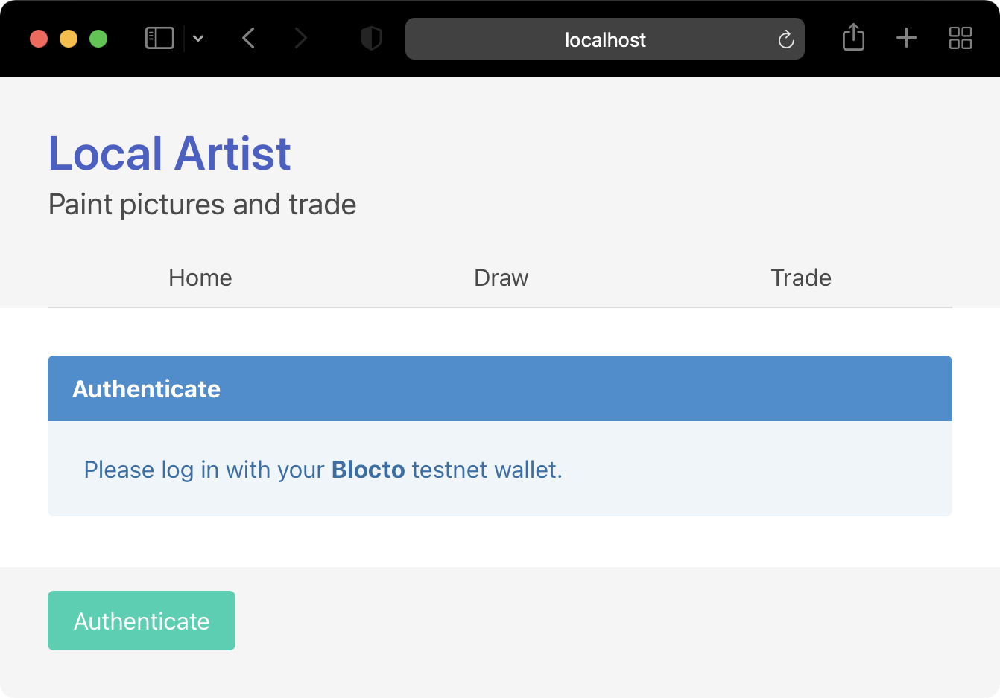

# Fast Floward | Week 1 | Day 4

Welcome back! It's Day 4 of Fast Floward. Today, we're finally ready to put it all together and ship our first decentralized application – Artist. To do that, we're going to learn about the **Flow Client Library (FCL)**, how to operate on the Flow testnet, and how to integrate Flow with a JavaScript/React client. Don't worry, you won't need to know much about JavaScript or React. All the client-side scaffolding is in place, and you will only have to worry about Cadence, FCL, and the Flow testnet. Day 4 is going to be AWESOME!

A quick review of Day 3 before we get going.

# Day 3 Review

- Flow Emulator provides a full blockchain experience hosted on your local computer.
  - Create cryptographic key pairs.
  - Create and modify accounts.
  - Build, sign, and send transactions.
  - Execute scripts.
  - Deploy as many contracts as you like.
- The `flow-cli` uses a configuration file `flow.json` to store information about your project.
  - Create aliases for your accounts.
  - Link contract names with source files.
  - Assign contract deployment to individual accounts on a per network basis.
- Cadence `event`s allow the contract to communicate when certain things happen.
  - Transactions don't return results to senders, but using `emit EventName` in your contract, you can receive information about what happend as part of the `.events` field of the transaction result.

# Videos

- [Flow Client Library (FCL), Flow Testnet](https://youtu.be/5XWWWbOd78k)

# Office Hours

- [Placeholder]()

# Flow Client Library – FCL

Yesterday, we got see how cryptography plays a part in Flow. When we send transactions, those transactions need to be signed using a private key. As developers, we have no problem with that – just generate a key pair, store it somewhere safe, and associate that key with a newly created account. We're then able to sign transactions by using `flow.json` as our private key store, and allowing `flow-cli` to plug everything in.

However, if you wanted to enable someone accross the internet to use your DApp, you would never ask them for their private key. Imagine, you're selling lemonade, a customer walks up, it's $1, however, you only accept payment, if you can enter their home with their keys and pick up the dollar bill from the kitchen counter yourself. That's silly. Don't be silly.

So if we can't have their private keys, how do we sign their transactions? We send our built transactions to the user's wallet, they take a look at the contents, and either confirm, or reject the transactions.

One last detail, there are many wallet providers, and integrating with them all would be a tedious and fragile process. In comes the Flow Client Library, or FCL, to the rescue!

## SDK + Authentication

With FCL, you get an entire JavaScript SDK with an authentication layer on top. Meaning, all you have to do to start interacting with a user is call two methods.

```javascript
fcl.authenticate()
fcl.currentUser().subscribe()
```

You also get all of the familiar `transaction` and `script` functionality in a nice, abstracted form.

```javascript
fcl.send([
  fcl.script`
    pub fun main(): String {
      return "Hi, FastFloward!"
    }
  `
])
```

This is just to give you a glimpse of FCL, we'll explore it further, using our real-world DApp examples. To learn more about FCL, right from the horse's mouth, have a look at [Inside Flow: The Power of Simplicity with FCL][1], it's a recent blog post from the Flow team, where they build a strong case for FCL.

# Artist

All this week we were building towards an end goal – a decentralized app that prints our unique drawings as `Picture`s that we own, just like in the real world. But an app is not an app if we can't use it as regular users. Today we're going to explore a client implementation and how it can interact with Flow.

Let's begin by exploring the contents of the folder `Artist`.

## Client

Inside you will find the exact same client as on [artist.flowdeveloper.com][2], with the only difference being that the Cadence code is missing.

This is a JavaScript/React application, If you're not familiar with either, don't worry. We don't expect you to write any JavaScript if you don't want to. We just want you to be able to run this locally. A few step to get there.

```sh
cd Artist
npm i
echo "PUBLIC_URL=/public/" > .env
npm run start
```

If everything went well, your browser should open up the `http://localhost:3000` URL and render a page that should look like this.



## Structure

When you execute the `npm run start` command, you launch a development server that conveniently reloads the app every time you change the source code. For the time being, that's all we need in terms of deploying the app.

Then you have two important locations inside of `Artist/`.

```
src/context/Flow.jsx // The only file that requires modify.
src/cadence/ // This is where the LocalArtist contract lives.
```

The Artist client app uses `Flow.jsx` as a single point of contact with the Flow blockchain. Inside, you'll find a React context, and it's made available throughout the pages of the app. The main part is that in this file we create functions that wrap around our transactions for later use.

```jsx
<Context.Provider
  value={{
    state,
    isReady,
    dispatch,
    logIn,
    logOut,
    fetchBalance,
    fetchCollection,
    createCollection,
    destroyCollection,
    printPicture
  }}
>
  {props.children}
</Context.Provider>
```

Right now, those functions (`logOut`, `logIn`, etc.) are stubbed out. Our goal today will be to implement them by executing scripts and transactions that exist in `src/cadence/` with the help of **FCL**. Some implementations will be one-liners, some will require a little more effort.

Hopefully, we now have a basic understanding of the project structure as far as today is concerned. Our next step will be to configure Flow for testnet usage, let's go!

# Flow Testnet

Day 3 was all about the emulator and interacting with a local instance of the Flow network. Today we want to go public! We'll do that by deploying our `LocalArtist` contract to the Flow testnet. The process is exactly the same as the process to deploy emulator contracts. The only difference – we don't have direct access to the testnet service account, and we can't create an account without already having an account. But Flow have got us covered.

## Flow Faucet

We can create and fund an account on testnet using the [flowfaucet][3]. It's a free service. Thanks Flow! All that's needed is a public key that we can generate using the `flow-cli`.

```sh
flow keys generate --sig-algo "ECDSA_secp256k1"
```

Don't forget to select the appropriate *Signature Algorithm* and stay human. Click **Create Account**. After a few moments we'll get a new account address with 1,000 FLOW tokens inside, sweet!

Now, let's create a new `flow.json`. Make sure that you're in the `/day4/Artist/src/cadence/` folder.

```sh
flow init
```

Then update it with all the relevant information we just got.

```json
{
  ...,
  "contracts": {
    "LocalArtist": "./LocalArtist/contract.cdc"
  },
  "accounts": {
    ...,
    "testnet-local-artist": {
      "address": "0x01",
      "key": {
				"type": "hex",
				"index": 0,
				"signatureAlgorithm": "ECDSA_secp256k1",
				"hashAlgorithm": "SHA3_256",
				"privateKey": "abc"
			}
    }
  },
  "deployments": {
    "testnet": {
      "testnet-local-artist": [
        "LocalArtist"
      ]
    }
  },
  ...
}
```

One more thing, we'll need to share the contract account address with the client, so we need to also update our `.env` file that we created earlier with the following. Please replace `0x01` with your testnet account address.

```env
PUBLIC_URL=/public/
REACT_APP_ARTIST_CONTRACT_NAME=LocalArtist
REACT_APP_ARTIST_CONTRACT_HOST_ACCOUNT=0x01
```

## Deploy LocalArtist

You might have noticed that we're using `LocalArtist` as a different name for our contract. Since a storage path must be unique, we want to avoid naming conflics with [artist.flowdeveloper.com][2] contract storage. Another change is that we're no longer using ' ' and '*' for on/off pixels, from now on we'll use '1' for an on pixel, and '0' for an off pixel. You might find other changes in the contract if you're curious.

Right, on to deploying the `LocalArtist` contract to testnet.

```sh
flow project deploy --network=testnet
```

Another useful tool for working on the testnet is [flow-view-source.com][4], I've linked to my testnet contract account, but you can change the address and explore any other testnet account.

Now, let's test out our deployment using `flow-cli` before we move on to FCL. Before executing the first transaction, please make sure to update the contract account address in `print.cdc`.

```sh
flow transactions send ./LocalArtist/transactions/print.cdc \
  --network=testnet \
  --signer testnet-local-artist \
  --args-json='[{"type": "Int", "value": "5"}, {"type": "Int", "value": "5"}, {"type": "String", "value": "0111010001000100010011111"}]'
```

If successful, we should see 5 events from executing this transaction.

```sh
flow scripts execute ./LocalArtist/scripts/getCanvases.cdc \
  --network=testnet \
  --args-json='[{"type": "Address", "value": "0x01"}]'
```

And our script should display a `Collection` with one picture in it.

# FCL Integration

Now that we have confirmed our contract deployment, we can proceed to integrating `fcl`.

First, we need to configure the network and the wallet we want `fcl` to use. This is done in `/src/index.js`.

```javascript
import * as fcl from '@onflow/fcl';

fcl
  .config()
  .put('accessNode.api', 'https://access-testnet.onflow.org')
  .put('discovery.wallet', 'https://fcl-discovery.onflow.org/testnet/authn');
```

We do it once at the entry point to our client. Since we're operating on the testnet, we're using the testnet Access Node as well as the testnet wallet.

## Log in

In order to manage user authentication, we use two functions. We just need to place them in the right spot within `Flow.jsx`.

```javascript
fcl.logIn(); // Log in or sign up if user doesn't have a wallet.
fcl.unauthenticate(); // Log out.
```

## Scripts and Transactions

FCL provides a single interface sending for both scripts and transactions. For example, a transaction would look like this.

```javascript
import * as fcl from '@onflow/fcl';
import * as FlowTypes from '@onflow/types';

async function sendTransaction() {
  const transactionId = await fcl
    .send([
      fcl.transaction`
        // Your Cadence code...
      `,
      fcl.args([
        fcl.arg("Hello, FastFloward!", FlowTypes.String)
      ]),
      fcl.payer(fcl.authz),
      fcl.proposer(fcl.authz),
      fcl.authorizations([fcl.authz]),
      fcl.limit(9999)
    ])
    .then(fcl.decode);

  return fcl.tx(transactionId).onceSealed();
}
```

The `fcl.authz` value is just shorthand for the current user. Before returning, we wait until the transaction is *sealed*.

To execute a script is very similar.

```javascript
import * as fcl from '@onflow/fcl';
import * as FlowTypes from '@onflow/types';

async function sendTransaction() {
  const result = await fcl
    .send([
      fcl.script`
        // Your Cadence code...
      `,
      fcl.args([
        fcl.arg("Hello, FastFloward!", FlowTypes.String)
      ]),
    ])
    .then(fcl.decode);

  return result;
}
```

This information should be enough to get you started. For more, please inspect the [Flow Client Library docs][5].

# Quests

We're finally building real decentralized apps, that's EPIC! To celebrate, we have only one quest today. Well, one quest consisting of 7 parts...

- `W1Q8` – Client is King

Perform a search for `TODO:` inside of the `Artist/` folder and implement all of those tasks using the `fcl` framework. After you've implemented every `TODO` item, you should have a fully functioning local Artist app that interacts with the testnet!

As part of your submission, please fill out `quest.md` with your testnet account addresses. Also, make sure to print some pictures, we'll make sure to compare which one of you ends up with the best Picture collection.

Best of luck on your quest!

[1]: https://www.onflow.org/post/inside-flow-the-power-of-simplicity-with-fcl
[2]: https://artist.flowdeveloper.com/
[3]: https://testnet-faucet.onflow.org/
[4]: https://flow-view-source.com/testnet/account/0xda65073324040264
[5]: https://docs.onflow.org/fcl/