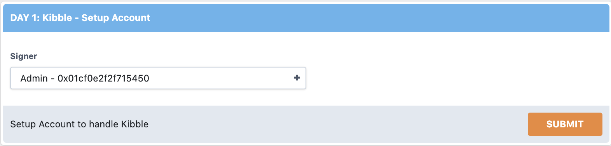
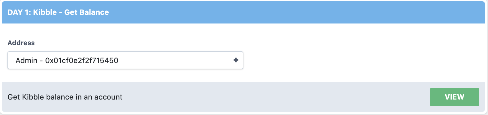

# Fast Floward | Week 2 | Day 1

Helloooo! Jacob here. You will be stuck with me for the remaining parts of the bootcamp (Weeks 2 and 3). You have probably seen me in the Discord answering questions, so I hope I'm not a total stranger. Although I am not as awesome as Morgan, I hope we can have some fun and learn so much more about Flow/Cadence together.

This week, we will wrap up our introduction to the Cadence programming language and begin to explore DappStarter, a platform created by us at Decentology that allows developers like you to get a full-stack dApp running quickly.

You should begin by watching the videos below. The first video will wrap up Cadence concepts by going over Access Control. The second will go over Contract Interfaces and Pre/Post-Conditions. The third video will help you download your first Foundation from DappStarter. Lastly, there is a video covering general DappStarter architecture.

**Please note**: there are a lot of videos to watch today. Because of that, I made your quests much shorter. In fact, you should complete 1/2 of your quests by simply following along the "Getting our DappStarter dApp" video.

# Videos

- [Access Control in Cadence](https://www.youtube.com/watch?v=_CNxRMIrN98)
- [Contract Interfaces & Post/Pre-Conditions](https://www.youtube.com/watch?v=nONO4MSou5Y)
- [Getting our DappStarter dApp](https://www.youtube.com/watch?v=-CuH95wtR-I)
- [DappStarter Architecture Overview](https://youtu.be/scZZiFXfXa4)

# Wrapping up Cadence Concepts

Last week, you went over a ton of Cadence concepts and basic syntax thanks to Morgan. This week we're going to wrap it up, first by covering Access Control and then by going over Contract Interfaces.

## Access Control

Access Control describes the way in which we can use things called "Access Modifiers" to increase the security of our smart contracts. 

Previously, you may have declared all of your variables and functions using the `pub` keyword, like so:
```cadence
pub let x: Bool

pub fun jacobIsAwesome(): Bool {
  return true
}
```

But what exactly does `pub` mean? Why are we putting it there? Are there other things we can do instead? I want to answer those questions here.

Let's take a look at this diagram to help give us an idea of all the different access modifiers we can use.


In the video, we only focus on the `var` rows, because `let` does not have a write scope since it is a constant. I encourage you to watch the video before reading over this next section.

Note: [here is the playground from the video.](https://play.onflow.org/2cc441ff-d356-4e36-a45f-715278bd658f?type=account&id=b97af048-15a4-445d-95fe-a31becc2ce41)

### Scope

Scope is the area in which you can access, modify, or call your "things" (variables, constants, fields, or functions). There are 4 types of scope:

1. All - this means we can access our thing from wherever we want. Inside the contract, in transactions and scripts, wherever.
2. Current & Inner - this means we can only access our thing from where it is defined and inside of that.

Ex. 
```cadence
pub struct TestStruct {
  
  pub var x: String

  // The "current and inner scope" for 'x' is here...

  pub fun testFunc() {
    // and in here.
  }

  init(){...}
}
```
3. Containing Contract - this means we can access our thing anywhere inside the contract that it is defined.

Ex. 
```cadence
pub contract TestContract {

  // The "containing contract" for 'x' is here...

  pub struct TestStruct {
    
    pub var x: String

    // here...

    pub fun testFunc() {
      // and in here.
    }

    init(){...}
  }
}
```
4. Account - this means we can access our thing anywhere inside the account that it is defined. Remember: we can deploy multiple contracts to one account.

### pub(set)

`pub(set)` only applies to variables, constants, and fields. Functions **cannot** be publically settable. It is also the most dangerous and easily accessible modifier.

Ex.
```cadence
pub(set) var x: String
```

Write Scope - **All**

Read Scope - **All**

### pub/access(all)

`pub` is the same thing as `access(all)`. This is the next layer down from pub(set).

Ex.
```cadence
pub var x: String
access(all) var y: String

pub fun testFuncOne() {}
access(all) fun testFuncTwo() {}
```

Write Scope - Current & Inner

Read Scope - **All**

### access(account)

`access(account)` is a little more restrictive than `pub` due to its read scope.

Ex.
```cadence
access(account) var x: String

access(account) fun testFunc() {}
```

Write Scope - Current & Inner

Read Scope - Account

### access(contract)

`access(contract)` is a little more restrictive than `access(account)` due to its read scope.

Ex.
```cadence
access(contract) var x: String

access(contract) fun testFunc() {}
```

Write Scope - Current & Inner

Read Scope - Containing Contract

### priv/access(self)

`priv` is the same thing as `access(self)`. This is the most restrictive (and safe) access modifier.

Ex.
```cadence
priv var x: String
access(self) var y: String

priv fun testFuncOne() {}
access(self) fun testFuncTwo() {}
```

Write Scope - Current & Inner

Read Scope - Current & Inner

## Contract Interfaces

I know, I know. More Cadence. Ugh. We're almost done... just kidding! We will be stuck with Cadence for 2 more weeks, so we might as well keep going. :)

Contract interfaces are very similar to what we learned last week with resources. They are a little different, though, and it will appear in some examples this week, so let's go over it quickly (don't worry, it's not that bad).

Let's define a sample contract interface:

```cadence
pub contract interface TestContractInterface {
  pub let x: Int

  pub fun readX(): Int {
    post {
      result == self.x:
        "The result is not equal to x. That's a problem."
    }
  }

  pub resource interface INFT{
    pub let y: Int
  }

  pub resource NFT: INFT {
    pub let y: Int
  }
}
```

There's multiple things going on here. First, we've defined a constant named `x`, a function named `readX`, a resource interface named `INFT`, and a resource named `NFT` that implements the `INFT` resource interface. But what is this doing? What's the point here?

Well, we can use this contract interface to require other contracts to implement its fields, functions, variables, and constants. Let's use our example from above:

```cadence
import TestContractInterface from './TestContractInterface'
pub contract TestContract: TestContractInterface {
  pub let x: Int

  pub fun readX(): Int {
    return self.x
  }

  pub resource NFT: TestContractInterface.INFT {
    pub let y: Int

    init() {
      self.y = 1
    }
  }

  init() {
    self.x = 0
  }
}
```

As you can see, we had to define an `x` constant, a `readX` function that returns `x`, and a resource named `NFT` that implements `TestContractInterface.INFT` and has field named `y`. Note that `NFT` MUST be named "NFT" or we will receive an error. Similarly, we cannot define our own `INFT` resource interface in `TestContract`. We MUST have `NFT` implement `TestContractInterface.INFT` because that is how `TestContractInterface` is written.

## A Side Note on Pre-Conditions & Post-Conditions

In the example above, you can see we used a **post-condition**. These are most often used in contract interfaces, but you will see them in normal contracts as well. They are both used as an extra security layer and as a means of expressing intent; it makes sure contract functions behave accordingly.

Let's look at the above example:

```cadence
pub contract interface TestContractInterface {
  pub let x: Int

  pub fun readX(): Int {
    post {
      result == self.x:
        "The result is not equal to x. That's a problem."
    }
  }

  {...}
}
```

The post condition here is being used to make sure that whoever implements `TestContractInterface` MUST have a function named readX that returns `self.x`. Not any other value.

Similarly, **pre-conditions** are used to check conditions are met before a function even excecutes. Here's an example:

```cadence
pub contract TestContract {

  {...}

  pub fun deposit(amount: Int): Int {
    pre {
      amount > 0:
        "We do not want to deposit any value equal to or below 0."
    }

    {...}
  }

  {...}

}
```

In this example, assume we are depositing into our Vault. We want to make sure we don't accept an amount equal to or below 0 or it wouldn't make sense. We can do this using a **pre-condition**. It's important to describe why this is so useful:
1) Developer Intent - Any person calling deposit knows amount must be > 0.
2) Saves Time & Resources - If an amount <= 0 is deposited, we will save a ton of time by reverting the call immediately.
3) Extra Layer of Security - We prevent harmful/malicious acts on our own Vaults.

# Intro to DappStarter

Before reading this section, make sure to watch the associated video above. This section will go over some terminology we use for things you'll encounter in DappStarter so it will make sense for upcoming days.

## Action Cards


*An example of an action card that sends a transaction*



*An example of an action card that executes a script*


Action cards are used to run transactions and scripts on the UI Harness. They each have different **widgets** inside them so we can pass parameters to our transactions and scripts. This can be very useful, because we no longer have to type out crazy json-formatted stuff into our command line. Instead, we can easily select accounts, insert numbers, etc.

The action cards that have an orange Submit button on them send transactions to the blockchaiin. Action cards that have a green View button execute scripts.

## Widgets

**Widgets** are the pieces of UI we use to select parameters inside our **action cards**. There are two main types of widgets you should know:


*An example of an account widget*

1) Account widgets - these widgets allow you to select an account. We can use these to select signers, recipients of a transfer, etc.


*An example of an account widget*

2) Text widgets - these widgets allow us to type in numbers. We can use these to put in an amount, a price for our Kitty Items, etc. 

*Note*: in any text widgets that have an "Amount" label, you MUST use numbers that have a decimal. For example, if you want to input 30, you have to put 30.0. This is because "Amount" takes in Fixed numbers, not Integers.

# Quests

For day one, we have two quests: `W2Q1` and `W2Q2`. These quests will be pretty short because I know I'm throwing a lot at you today. 

These quests also won't cover contract interfaces or post/pre-conditions because I don't want to overwhelm you. I will be here right alongside you to help whenever and wherever you need. If you need assistance while solving these, feel free to ask questions on Discord in the **burning-questions** channel or reach out to me in a DM if need be. You got this!!

- `W2Q1` – Access Control Party

Look at the w2q1 folder. For this quest, you will be looking at 4 variables (a, b, c, d) and 3 functions (publicFunc, privateFunc, contractFunc) defined in some_contract.cdc. You will see I've marked 4 different areas (#1, #2, #3 in some_contract.cdc, and #4 in some_script.cdc) where I want you to answer the following task: For each variable, tell me in which areas they can be read (read scope) and which areas they can be modified (write scope). For each function, simply tell me where they can be called.

Ex. In Area 1:
1. Variables that can be read: a and c.
2. Variables that can be modified: d.
3. Functions that can be accessed: publicFunc and privateFunc
Note: this is very wrong ^, haha!

- `W2Q2` – Dappiness

For this quest, follow the [Getting our DappStarter dApp](https://www.youtube.com/watch?v=-CuH95wtR-I). Get the Fast Floward Foundation on DappStarter and attempt to run your project as instructed in the video. If you can `yarn start`, see the UI Harness, and submit all the Day 1 **action cards**, you are done! Simply submit a screenshot of the return values on the action cards :)

Best of luck on your quests, you got this. See you next time Cadence adventurers ~
