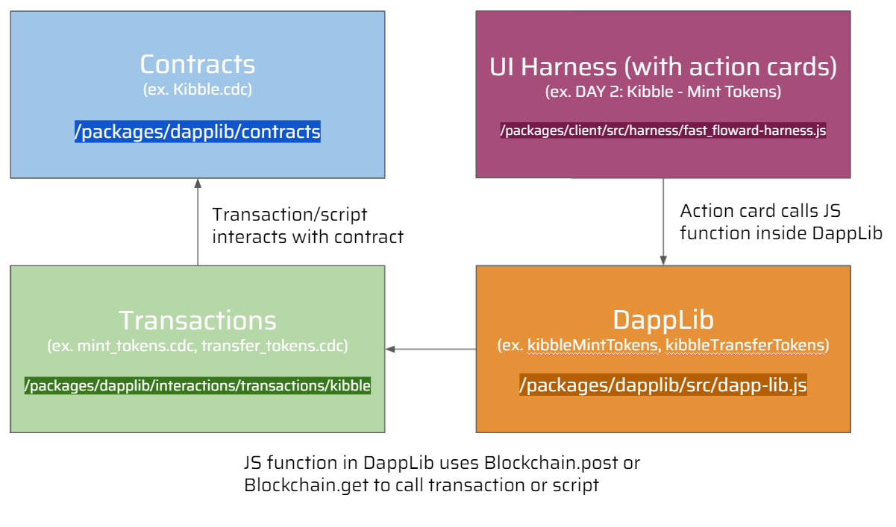

# Flow 快速入门 | 第二周 | 第二天

我们回来了，状态不错。如果你已经完成了第 2 周第 1 天的内容，我很高兴你活下来了! 我们今天有更多有趣的事要做。

今天，我们将在 DappStarter 上浏览 Fast Floward Foundation 的所有 3 个合约。这将是一个艰难的过程，但我对你们所有人都有信心。我要从一开始就说:如果你觉得我把你逼疯了，那是因为我确实是。如果你觉得很难，那是因为它确实很难。
不用担心。一开始你可能会很挣扎，但我相信如果我们一起努力，你会从中学到很多。

让我们开始吧

# 课程复习
- 我们学习了权限控制
- 我们学习了合约接口，并做了一些前置/后置条件
- 我们熟悉了 DAppStarter 的架构
- 我们下载了第一个 DApp https://dappstarter.decentology.com/

# 视频

- [Kitty Items 合约概览](https://www.youtube.com/watch?v=zFtc4QLrxas)
- [第二天课程的完成示例](https://www.youtube.com/watch?v=7L8ixcpB_tE)

# 项目概览

Fast Floward 基金会是由 Kitty Items 项目建立的。Kitty Items 是 Flow 团队为 Flow 领域的初学者提供的一个示例项目，帮助他们学习更多关于Cadence 语言的知识。我在 DappStarter 上重新编写了这个项目，为你提供了更好的学习体验。具体来说，我删除了合约、交易和脚本的某些部分，这样我们就可以在任务中重新构建这些内容。我还重新编写了 Marketplace 合约，并对代码进行了注释，希望能够让它变得更容易理解，尽管在此过程中仍然会有一些障碍。

下面是一段介绍这三个合约的视频。抱歉我不会深入描述合约中的所有个人资源、结构等，因为合约本身已经有了广泛的注释。所以，如果你有任何问题，我鼓励你阅读下面的总结，看视频，阅读合约中的注释，然后在热点问题频道问我 :D

[Kitty Items 合约概览](https://www.youtube.com/watch?v=zFtc4QLrxas)

# 项目合约

视频中的合约存放在 dApp 的 `/packages/dapplib/contracts/Project` 目录下

## Kibble

Kibble 是我们在`Kibble.cdc`中定义的一种同质化代币。当你在第 1 周使用 Flow Token 时，你看到了一个可替换 Token 的例子。它们被表示为一个简单的`UFix64`，并通过`Vault`资源传递。它们由`Minter`资源铸造。你现在只需要知道这些就够了。

注意 Kibble.cdc 实现了 FungibleToken 合约接口，使我们的 Kibble 成为官方的 FungibleToken。它也是如何设置自己的 FungibleToken 并开始自己试验的好例子:)

注意:我们会对合约进行修改。它不是完全在你的代码实现。你将在 W2Q3 和 W2Q4 任务期间完成。

## Kitty Items

Kitty Item 是一种非同质化代币(NFT)。它们由一个 `NFT` 资源表示，并存储在一个`Collection` 资源中，该资源将位于每个帐户中，非常类似于你在第 1 周看到的 `Picture` 资源的集合。它们是由 `NFTMinter` 资源铸造的。

我们将 Kitty Items 和 NFTs 视为相同的东西。还要注意，Kitty Items 合约实现了 NonFungibleToken 合约接口。这意味着 NFT 资源实现了NonFungibleToken.INFT，这意味着它是 Flow 标准下的正式 NFT。如果我们愿意，我们的 Kitty 道具可以在 OpenSea 等 NFT 市场上交易、购买或出售。

最后，就像 Kibble 是 FungibleToken 的一个很好的例子一样，Kitty Items 也是我们想要构建自己的 NFT 合约的一个很好的例子。这周我们不会这样做，但是开始试验一下你如何定义你自己的 nts 叫 JacobsTheBestTeacherEver，就像 KittyItems 一样。

## Kitty Items 市场

Kitty Items 市场是用户出售自己的 Kitty Items 的地方。每个想要出售 Kitty Items 的账户都将在其账户中存储一个 `SaleCollection` 资源。然后，他们可以指定一个价格和他们想要出售的 Kitty Item，允许任何用户使用 Kibble 从它购买。

重要的是 `SaleCollection` **并不** 实际存储要出售的 nft。它们只存储所有者想要销售的 nft 的 id。NFTs 只会从主人的`KittyItems.Collection` 中删除。一旦他们被购买，在这种情况下，SaleCollection 将他们从 `self.ownerCollection` 提出。`SaleCollection` 还存储了主人的 Kibble Vault ，当购买它时，可以将 Kibble 存入其中。

# 有用的 DappStarter 概述

DappStarter 一开始可能会令人困惑。你可能会问……`好吧，我正在修改合约，但这是怎么运作的?` DappStarter 在幕后是怎么做的?`

我们将在本周内回答这个问题，以便在第二周结束时， 你将理解DappStarter是如何将一切联系在一起的。现在你可以使用下面的图表来帮助你:

尽管 你可能不了解 DappLib 是什么，甚至不了解 UI Harness，但在接下来的日子里，这将是有意义的。不过， 你现在可以使用这个图表作为参考。

# 任务

我们今天有两个任务，`W2Q3`和`W2Q4`。 你将 **仅仅** 修改 Kibble.cdc。请务必观看上面关于 W2Q3 和 W2Q4 的视频。

同时，这些任务将会比前几天短。***我建议你花时间看一下这 3 份合约，如果 你有什么问题可以问一下。*** 在接下来的日子里，我们将编写与这些合约交互的交易和脚本，所以了解它们在做什么是很重要的。另外，下周我们将写我们自己的合约，所以很重要的是，你要开始问自己，你可能会建立类似的合约。

- `W2Q3` – 嘿，函数去哪了?

看看 Kibble.cdc。如果你查看 `Vault` 资源，你可能会注意到 `deposit` 功能消失了。类似地，`Minter` 资源中的 `mintTokens` 函数没有实现。 你的工作是遵循我在代码中编写的注释并自己实现这两个函数。你可以阅读周围的注释，也给你一些提示。

然后，`yarn start` 启动你的dApp，然后进入 UI Harness。看看上面写着 `第2天:Kibble-铸造代币` 的 **行动卡** 是否有效。`第一天: Kibble -获得余额` **行动卡**，检查 Kibble 是否被创建到你选择的账户。
注意:在 `deposit` 函数中，我要求你使用一个新的语法: `as!`。你可以在 KittyItems.cdc 中找到一个例子, 如果有帮助的话。

- `W2Q4` – 咋还有提现啊?!?!?

你会注意到 `Vault` 资源中的 `withdraw` 功能也消失了！天啊，删除这些功能的人一定是个白痴…

不管怎样，用 W2Q3 做同样的事情。按照我给你留下的注释和提示来执行 `提现` 功能。然后，转到 UI Harness，看看上面写着 `第2天 : Kibble - 转移 token` 的 **动作卡** 是否有效。你可以检查它是否与 `第一天 : Kibble -- 获得余额` **行动卡**，看看 Kibble 是否从一个帐户转移到另一个。

## 我该如何提交?

对于 W2Q3 和 W2Q4，请提交你更新的 Kibble.cdc 合约和你的动作卡的截图，如视频所示。你不用像我一样用 30.0。尝试尝试不同的值!

祝你任务顺利，下期再见 Cadence 冒险家~

