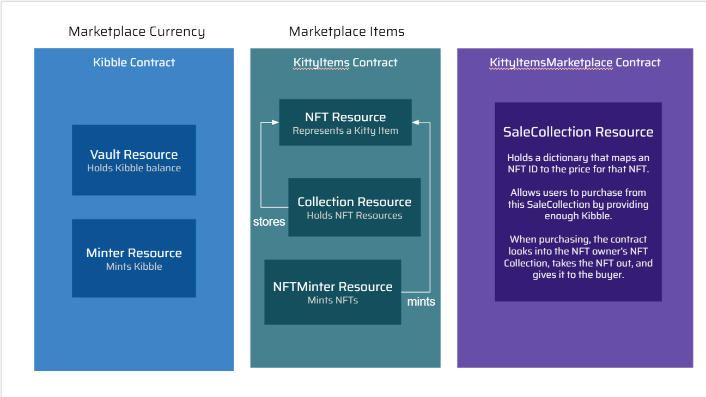

# This is not officially out yet.

# Fast Floward | Week 2 | Day 2

And we're back, better than ever. Happy Tuesday <3 If you have already completed Week 2 Day 1 content, I'm glad you survived! We got some more fun stuff to do today. 

Today, we're going to be going over all 3 of the contracts in the Fast Floward Foundation on DappStarter. It's going to be a tough one, but I have faith in all of you. I will say this from the beginning: if you feel like I'm throwing you off the deep end, it's because I am. If you feel like it's difficult, it's because it is. No need to worry. You may struggle at first, but I believe if we work through this together you will walk out of this learning a lot. 

Let's get into it.

# Videos

- [Kitty Items Contract Overview](https://www.youtube.com/watch?v=zFtc4QLrxas)
- [What a Completed Day 2 Will Look Like](https://www.youtube.com/watch?v=7L8ixcpB_tE)
# Project Overview

The Fast Floward Foundation is built from Kitty Items. Kitty Items is a sample project that the Flow team provides to beginners in the Flow universe to learn more about the Cadence language. I took this project and re-wrote it on DappStarter to give an even better learning experience for you. Specifically, I removed some parts of the contracts, transactions, and scripts so we can build it back up together in quests. I also re-wrote the Marketplace contract and commented the living heck out the code to hopefully make it understandable, although there will still be speed bumps along the way.

The following is a summary of the long (i'm so sorry) video that introduces you to each of the 3 contracts.

## Kibble

Kibble is a type of Fungible Token that we define in `Kibble.cdc`. You saw an example of Fungible Tokens when you used Flow Token during Week 1. They are represented as a simple `UFix64` and are passed around through `Vault` resources. They are minted by the `Minter` resource. That's all you really need to know for now.

Note: We will be making modifications to this contract. It is NOT fully implemented in the code you have. You will complete it during the W2Q3 quest.

## Kitty Items

A Kitty Item is a Non-Fungible Token (NFT). They are represented by an `NFT` resource and are stored in a `Collection` resource that will lie in each account, very similar to the Collection you saw for `Picture` resources in Week 1. They are minted by the `NFTMinter` resource.

## Kitty Items Market

The Kitty Items Market is where users will list their Kitty Items for sale. Each account that wants to put their Kitty Items for sale will store a `SaleCollection` resource in their account. They can then specify a price and the Kitty Item they want to list for sale, allowing any user to purchase from it with Kibble.

It is important to note that the `SaleCollection` does **not** actually store the NFTs that are for sale. They only store the IDs of the NFTs that the owner wants to sale. The NFTs are only removed from the owner's `KittyItems.Collection` once they are bought, in which case the SaleCollection withdraws them from `self.ownerCollection`. The `SaleCollection` also stores the owner's Kibble Vault to deposit a Vault into it when a purchase it made.

# Quests

We have two quests today, `W2Q3` and `W2Q4`. You will **ONLY** be modifying Kibble.cdc. Please make sure to watch the video bove on what W2Q3 and W2Q4 will look like.

- `W2Q3` – Hey, Where'd the Functions Go?

Look at Kibble.cdc. If you look in the `Vault` resource, you may notice the `deposit` function is gone. Similarly, the `mintTokens` function in the `Minter` resource isn't implemented. Your job is to follow the comments I wrote in the code and implement those two functions yourself. You can read the surrounding comments to also give you some hints.

Then, `yarn start` your dApp and go to the UI Harness. See if the **action card** that says "DAY 2: Kibble - Mint Tokens" works. To check if it works, go to the "DAY 1: Kibble - Get Balance" **action card** and see if Kibble was minted into the account you chose.

Note: in the `deposit` function, I ask you to use a new syntax: `as!`. You can find an example of this in KittyItems.cdc if it helps.

- `W2Q4` – And Withdraw Too?!?!?

You'll notice that the `withdraw` function in the `Vault` resource is gone as well! Gosh, whoever removed these functions must be an idiot...

Anyways, do the same thing as W2Q3. Implement the `withdraw` function by following the comments and hints I left for you. Then, go to the UI Harness, and see if the **action card** that says, "DAY 2: Kibble - Transfer Tokens" works. You can check to see if it works with the "DAY 1: Kibble - Get Balance" **action card** to see if Kibble was transferred from one account to another.

Good luck on your quests. See you next time Cadence adventurers ~

