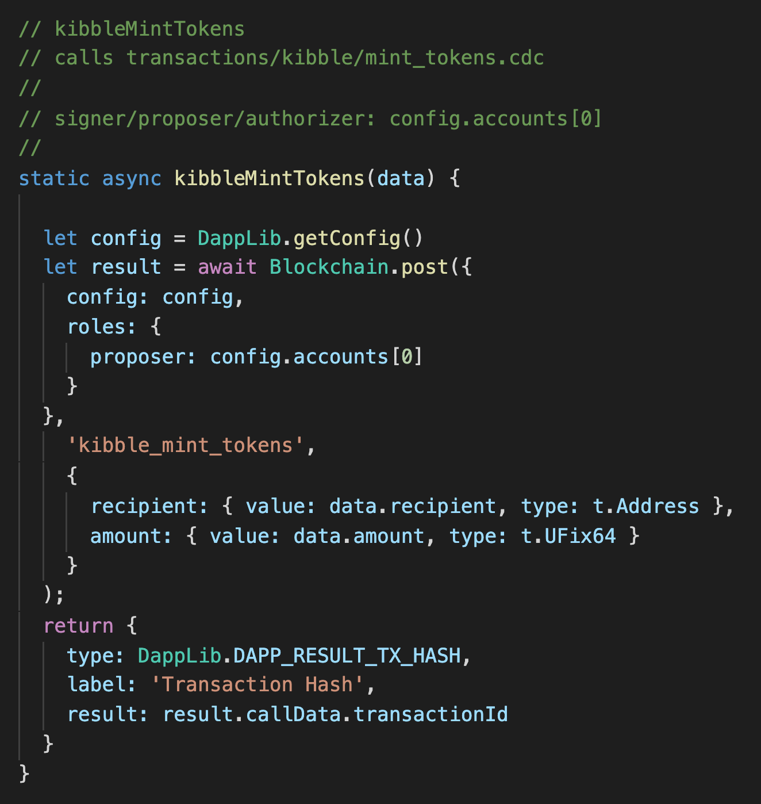
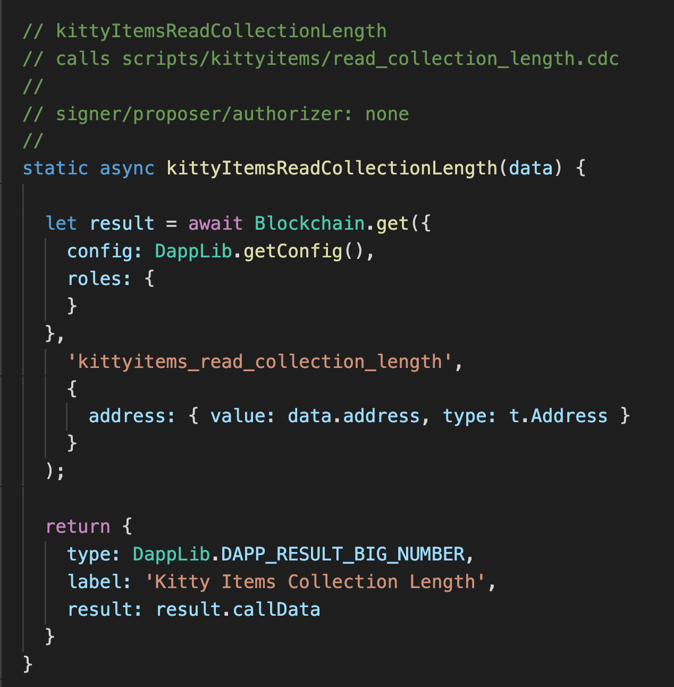

# Fast Floward | Week 2 | Day 3

Hi! It's your favorite person Jacob here to lead you through Week 2 Day 3 content. Yesterday, we went over the 3 contracts in our dApp that we got off of DappStarter. Today, we will be looking at how we can modify our DappLib, transactions, and scripts in order to learn how to interact with our contracts on DappStarter.

Let's get right into it.

# Videos

- [DappLib, Transactions, and Scripts](https://www.youtube.com/watch?v=Czg3mMLw1I4)

# DappLib

The DappLib lies in `packages/dapplib/src/dapp-lib.js`

From [Nik's architecture video on DappStarter during Week 2 Day 1](https://youtu.be/scZZiFXfXa4), we saw that the DappLib is extremely important in our project. In it are a bunch of Javascript functions that call transactions and scripts using `Blockchain.post` (for transactions) or `Blockchain.get` (for scripts).

You might be wondering how these DappLib functions are called. You don't have to worry about this for now, but I'll give you a short summary: They are called on the client side by our **action cards**. We will learn more about **action cards** and how to call our DappLib functions from the client tomorrow. 

We can take a quick look at the diagram from yesterday's readMe:


**Today, we will be looking at the DappLib and Transactions/Scripts. For now, just know that the client is already set up to call our DappLib functions that you'll be writing in your W2Q5 today.**

## Setting Up a Transaction Function in DappLib

Let's take a look at how to set up a DappLib function for a transaction:



Above is an example of how to set up a DappLib function to call a transaction. We start off by setting result to an async call to `Blockchain.post` because it's a transaction. We pass the first parameter of `Blockchain.post` an object that takes in two things: 
1) a config (which we can set to `DappLib.getConfig()`)
2) a `roles` object that takes in a `proposer`

The `proposer` is whoever we want to sign the transaction. Usually, we will set this to `data.signer`, which comes from the data object that is passed in from the client. You don't have to worry about how this works until tomorrow's video, so I have put the `proposer` for you in a comment before every function. Sometimes, you'll see that the `proposer` is `config.accounts[0]`. This is because if you look in `dapp-config.json`, you'll see an accounts object. We're using `accounts[0]` to get the account that all our Project contracts are deployed to. This is useful if we want the `proposer` to ALWAYS be the account that the contracts are deployed to (ex. if we've stored a Minter resource in the account's storage that the contract is deployed to).

Our next parameter to `Blockchain.post` is the name of the directory the transaction lies in followed by an underscore and the transaction file name, all in 'quotes'. For example, if we want to call `transactions/kibble/mint_tokens.cdc`, we will put 'kibble_mint_tokens'.

Next, we put an object that takes in all the parameters of our transaction. If you look at `kibble_mint_tokens.cdc`, you'll see it takes in two parameters: recipient (an address) and amount (a UFix64). For each, you write the name of the parameter, and map it to a object that takes in a `value`, which is passed from the client, and a `type`, which is the parameter's type. We use FCL for this by doing `t.{the type}`. Here's an example:

```javascript
{
  recipient: {value: data.recipient, type: t.Address},
  amount: {value: data.amount, type: t.UFix64}
}
```

**Note**: If the type is `t.UInt64`, you must wrap the value in a `parseInt()`. Here's an example:

```javascript
{
  typeID: {value: parseInt(data.typeID), type: t.UInt64}
}
```

Lastly, we return the result to the client. For transactions, you can always put this piece of code:

```javascript
return {
    type: DappLib.DAPP_RESULT_TX_HASH,
    label: 'Transaction Hash',
    result: result.callData.transactionId
}
```

This is what is returned to the client. If you use an **action card** that has a orange Submit button (meaning it's a transaction), you'll see a green rectangle appear with the label 'Transaction Hash'. This is due to the returned object above. We will see how this differs for scripts.

## Setting Up a Script Function in DappLib



Setting up a script function, like the picture above, is very similar to how we set up a transaction function. There are a few key differences though:

1) We use `Blockchain.get` instead of `Blockchain.post`
2) We leave the `roles` object empty, meaning we don't put a `proposer` (this is a script... so no one is signing it).
3) Instead of always returning a transaction hash, we can do stuff like this:

```javascript
return {
    type: DappLib.DAPP_RESULT_BIG_NUMBER,
    label: 'Kibble Balance',
    result: result.callData
}
```

The type can be one of many things, but you want it to match the return value of your script. If you return a UInt64, Int, or UFix64 from your script, use `DAPP_RESULT_BIG_NUMBER`. If your script returns an array, use `DAPP_RESULT_ARRAY`. If your script returns a dictionary, use `DAPP_RESULT_OBJECT`. There are others at the bottom of dapp-lib.js as well.

The label is what will show up next to the return value on the client side.

# Transaction and Script Files

Cadence transactions and scripts can be found in `packages/dapplib/interactions`. They are separated by Kibble, Kitty Items, and Kitty Items Market. 

If you click on these cadence files, you may notice the way we import contracts is unique. Instead of doing something like:

`import KittyItems from './kittyitems.cdc'`

we do:

`import KittyItems from Project.KittyItems`

This makes things a lot simpler and easier to read. The reason it is `Project.KittyItems` is because our KittyItems contract is defined in the `contracts/Project` folder. You can see this naming in `src/dapp-config.json` as well.

# Quests

I have one quest for you today, `W2Q5`. You will **ONLY** be modifying `transactions/kittyitems/mint_kitty_item.cdc`, `transactions/kittyitems/transfer_kitty_item.cdc`, `scripts/kittyitems/read_collection_ids.cdc`, and `src/dapp-lib.js`. Please make sure to watch the videos above before tackling these quests.

- `W2Q5` – The Mighty DappLib

For this quest, I want you to look for all the non-implemented functions in your `dapp-lib.js`. You can find them by searching for 'TODO' in the file. There are 2 transaction functions and 1 script function I want you to implement. I have already defined for you who the proposer is for each function, so your job is to set up the function as described above and make sure you pass it the correct parameters for the transaction/script you're calling.

Next, you will have to implement the transactions and scripts themselves. There are 2 transactions (`transactions/kittyitems/mint_kitty_item.cdc`, `transactions/kittyitems/transfer_kitty_item.cdc`) and 1 script (`scripts/kittyitems/read_collection_ids.cdc`) you will need to implement. I have left comments for you to help you in your journey.

Once you have completed this quest, you should be able to successfully run all of the DAY 3 **action cards**. Please submit a screenshot of working DAY 3 action cards, as well as your dapp-lib and transactions/scripts. I have described what your action cards should look like once you've completed this quest at the end of [this video.](https://www.youtube.com/watch?v=zFtc4QLrxas)


Good luck on your quests. See you next time DappStarter adventurers ~


