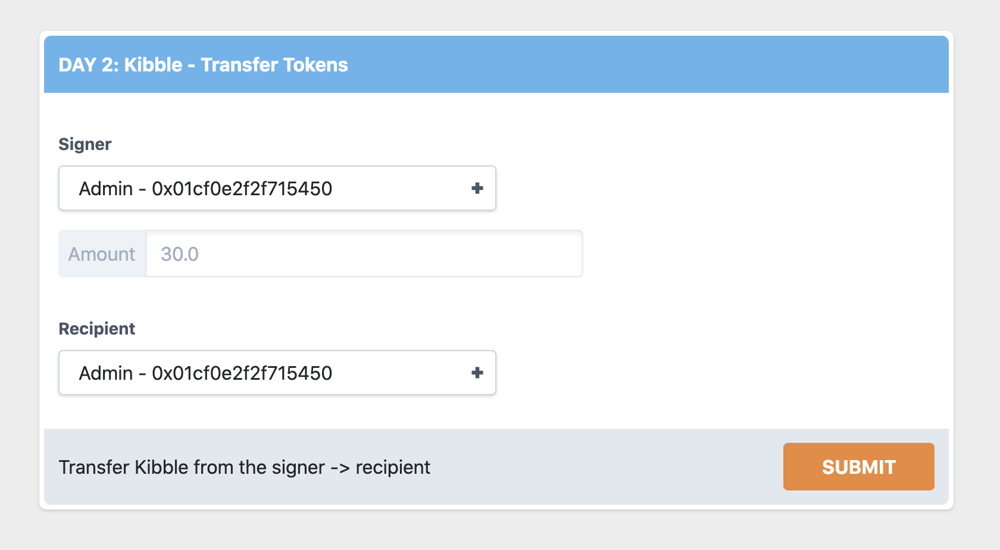
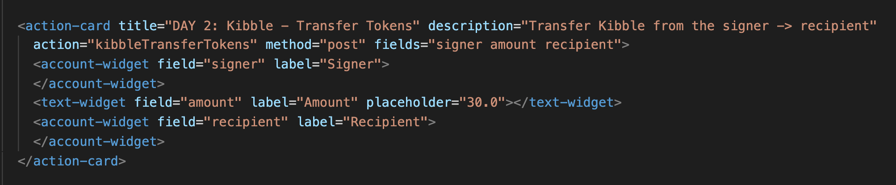
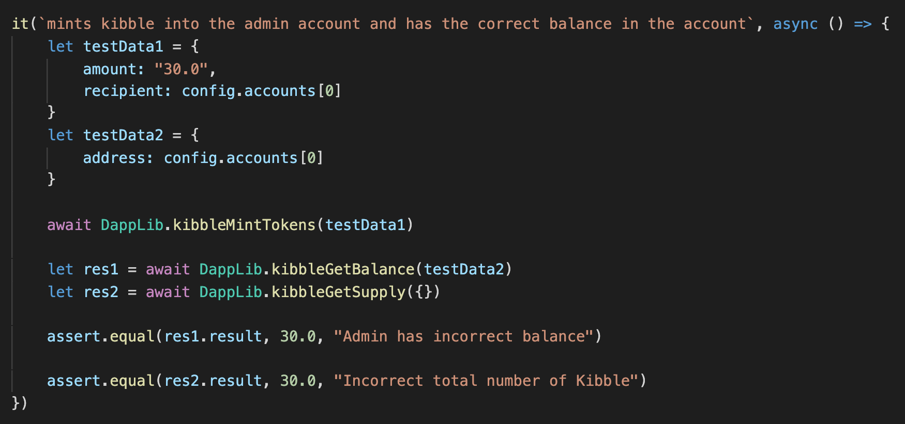

# Fast Floward | Week 2 | Day 4

Heyooo. Jacob here. Previously, we learned how to modify our contracts, transactions, scripts, and dapplib to get our dApp going. Today, we're going to be diving into the UI Harness and Testing on DappStarter, and by the end of it, you'll be conquerors of DappStarter :)

Let's get right into it.

# Videos

- [Client/UI Harness](https://www.youtube.com/watch?v=-Rka-0ytXhs&feature=youtu.be)
- [Testing](https://www.youtube.com/watch?v=0fBhXLJEr9Q)

# Client/UI Harness

In this section, we'll learn how to set up our UI Harness and how it connects to our DappLib. You can find the UI Harness in `packages/client/src/harness/fast_floward-harness`. Let's also bring back the diagram we've been using this week to understand the DappStarter architecture:

You'll see that the UI Harness calls the Javascript functions that we set up in our DappLib. Let's find out how.

## Setting Up an Action Card

`fast_floward-harness.js` has a bunch of Javascript in it that we don't need to worry about. Our main focus is going to be on the **action cards** and how to set them up. Let's look at an example of an action card in our UI Harness and also what it looks like in the code:

*This is what the action card looks like in the UI Harness*

*This is what the action card looks like in fast_floward-harness.js*

An **action card** element has 5 HTML attributes: 
1) **title** - this is the text on the top of your action card and represents the title of it
2) **description** - this is the text on the bottom of your action card that provides a simple description of what it does
3) **action** - this is the name of the Javascript function in your DappLib that this action card will call
4) **method** - either "post" (for transactions) or "get" (for scripts)
5) **fields** - all of the fields we will pass into our Javascript function in our DappLib. Each field will be mapped to a **widget**, which I will explain in the next section. You will access these fields in your DappLib using `data.{nameOfField}`

In the above example, you can see that we have 3 fields which are each represented by a widget (will be explained below). We are calling the kibbleTransferTokens function in our DappLib and passing in the 3 fields to it. This is why, in our DappLib, we wrote `data.signer`, `data.recipient`, and `data.amount`.

### Widgets

Widgets are used to pass in fields to our DappLib. For example, in the action card in the picture above, you'll see it had 3 fields: a signer, an amount, and a recipient. 

**Widgets** are most-often either a **text widget** or an **account widget**. 

#### Account Widgets

Account widgets allow us to select an account. We can use these to select signers, recipients of a transfer, etc. When we select an account, it will be passed into the DappLib when we hit "Submit" or "View".

Here is an example of an account widget:

In our code, an account widget takes in 2 HTML attributes:
1) **field** - this is the name of the field. It has to match with the field name we put in the **action card's** **field** attribute
2) **label** - this is the label that appears next to the account widget on the UI Harness

#### Text Widgets

Text widgets allow us to type in numbers or strings. We can use these to put in an amount, a price for our Kitty Items, a name, etc.

Here is an example of a text widget:

In our code, an account widget takes in 3 HTML attributes:
1) **field** - this is the name of the field. It has to match with the field name we put in the **action card's** **field** attribute
2) **label** - this is the label that appears next to the text widget on the UI Harness
3) **placeholder** - placeholder text that will appear in the text widget on the UI Harness

# Tests

If you've made it this far, you are so close to conquering DappStarter. Awesome job! 

The tests can be found in `/packages/dapplib/test/fast_floward-tests.js`. In it, you will find some Javascript code for testing, but you can ignore most of it. Your focus will be on writing **it()** functions to run individual tests. There are a few things to know about setting up a test.

Tests are run using the command `yarn test`. Just like `yarn start`, you type this command at the root of your project. It will start a brand new emulator so that there is no lingering data from your `yarn start`.

## Setting Up a Test

First, you will be calling your DappLib functions just like you do in the UI Harness. Here is an example of a test:

You'll see that we are calling our DappLib functions by doing `DappLib.{nameOfFunction}`. Unlike the UI Harness where we can pass in data through **widgets**, we need to make a `testData` object with the fields defined in it that have hard-coded values for your tests.

You'll notice that if we are calling a DappLib function that sends a transaction, we simple do it by `await DappLib.{nameOfFunction}(testData)`. This is because we don't care about the return value of the call. Howevever, if we call a DappLib function that executes a script, we most likely care about the return value. We can store it like so: `let res = await DappLib.{nameOfFunction}(testData)`. 

Afterwards, you can check your script return values with Javascript's `assert`. The actual value of the script can be achieved by `res.result`, and you can compare it to whatever value you expect it to return.

# Hot Loading

It is important to note that DappStarter supports hot loading. If you make any changes to your contracts, transactions, scripts, dapp-lib.js, or the client that we will introduce in tomorrow's content, you will not have to re-run `yarn start`. Your dApp will automatically re-compile for you.

# Quests

I have two quests for you today, `W2Q6` and `W2Q7`. You will **ONLY** be modifying `packages/client/src/harness/fast_floward-harness.js` and `packages/dapplib/tests/fast_floward-tests.js`. Please make sure to watch the videos above before tackling these quests.

- `W2Q6` – The Client

In `packages/client/src/harness/fast_floward-harness.js`, search for 3 action cards that have "TODO" above them. You will have to implement these 3 action cards. I have already implemented the DappLib functions, transactions, and scripts for you, so all you have to do is the action card step. When making your action cards, make sure you are passing in all the correct fields that your DappLib function needs using **widgets**.

Please submit the updated harness file as well as pictures of your action cards on the UI Harness.

- `W2Q7` – Testing Mania

For this quest, inside `packages/dapplib/tests/fast_floward-tests.js`, there are 2 tests for you to write. Follow the guide above on how to write tests (and use the other tests in the file as hints) to try and figure out how to set up the tests I have described for you. There are a bunch of comments above each of the two tests to try and help you in your implementation.

Be sure to submit the test file and a screenshot of all your tests passing in the console.

Good luck on your quests. See you next time DappStarter adventurers ~

